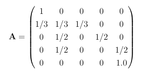
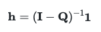
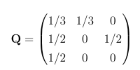

# Hitting times using linear algebra

If you have a Markov chain with a mixture of transient and absorbing states such as the one illustrated in the transition graph below the chain will eventually end up in one of the absorbing states.


In previous exercises we have learned how the average number of steps till absorbption can be calculated by sampling.  The expectations for these quantities can also be calculated using linear algebra, however.  In this exercise, I am going to show you how such calculations can be performed using a computer by considering the Markov chain with the transition graph above.

The transition matrix that corresponds to the Markov chain in the figure above is as follows:



It is straightforward to show that the hitting probabilities can be calculated using:



In this expression, I is the identity matrix, 1 is a vector that contains all ones and Q is a matrix that describes the transition probablities between the transient states.  For the Markov chain whose transition matrix is given above Q is:



Remember that you can set a variable equal to Q by using the `np.array` command.  You can then get a 3x3 identity matrix by using the following command:

```python
I = np.identity(3)
```

To invert the matrix `A` you can use the following command:

```python
inv = np.linalg.inv( A )
```

Lastly, if you want to multiply the 3x3 matrix `A` by a vector that contains all ones you would use the following command:

```python
# The quantity T that is output here is a vector
T = np.dot(  A, np.array([1,1,1]) )
```

You should be able to use the commands above to compute the hitting times using the formula above.  Your task here is therefore to use these ideas to draw a bar chart.  The x-coordinates of the bars should be set equal to the label for the initial transient states in the graph above.  The heights of the bars should then be equal to the expected number of steps till absorbtion if the chain starts in each of these intial states.  The title for the x-axis should be "Initial state".  The title for the y-axis should be "Expected number of steps till absorbtion"

 
